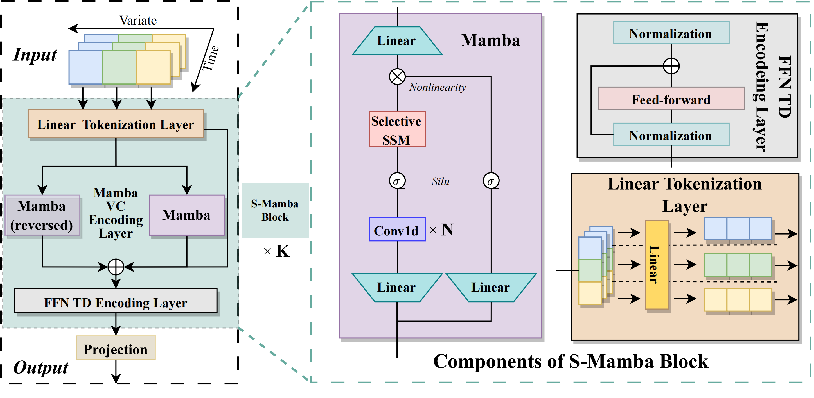

# Is Mamba Effective for Time Series Forecasting?

<a href='https://arxiv.org/abs/2403.11144'></a>

## :loudspeaker: Latest Updates

- **2024 Apr-27** : Updated our paper (v3). [[arXiv]](https://arxiv.org/abs/2403.11144v3) [[PDF]](https://arxiv.org/pdf/2403.11144v3). 
- **2024 Apr-02** : Updated our paper and released the code. You can refer to [[arXiv]](https://arxiv.org/abs/2403.11144) for more details. 

## S-Mamba



## Contributions :trophy:

- We propose S-Mamba, a Mamba-based model for time series forecasting, which delegates the extraction of inter-variate correlations and temporal dependencies to a bidirectional Mamba block and a Feed-Forward network. 
- We evaluate the performance of S-Mamba, which not only has low GPU memory required and short time for forecasts but also maintains superior performance compared to the representative and state-of-the-art models. 
- We conduct extensive experiments to further delve deeper into Mamba's potential in time series forecasting tasks.

## Getting Start :hourglass_flowing_sand:

### Installation

```bash
pip install -r requirements.txt
```

### Datasets

The datasets can be obtained from [here](https://github.com/wzhwzhwzh0921/S-D-Mamba/releases/download/datasets/S-Mamba_datasets.zip).

### Train and evaluate

```bash
# ECL
bash ./scripts/multivariate_forecasting/ECL/S_Mamba.sh
# Exchange
bash ./scripts/multivariate_forecasting/Exchange/S_Mamba.sh
# Traffic
bash ./scripts/multivariate_forecasting/Traffic/S_Mamba.sh
# Weather
bash ./scripts/multivariate_forecasting/Weather/S_Mamba.sh
# Solar-Energy
bash ./scripts/multivariate_forecasting/SolarEnergy/S_Mamba.sh
# PEMS
bash ./scripts/multivariate_forecasting/PEMS/S_Mamba_03.sh
bash ./scripts/multivariate_forecasting/PEMS/S_Mamba_04.sh
bash ./scripts/multivariate_forecasting/PEMS/S_Mamba_07.sh
bash ./scripts/multivariate_forecasting/PEMS/S_Mamba_08.sh
# ETT
bash ./scripts/multivariate_forecasting/ETT/S_Mamba_ETTm1.sh
bash ./scripts/multivariate_forecasting/ETT/S_Mamba_ETTm2.sh
bash ./scripts/multivariate_forecasting/ETT/S_Mamba_ETTh1.sh
bash ./scripts/multivariate_forecasting/ETT/S_Mamba_ETTh2.sh
```


## Acknowledgement :pray:

We are grateful for the following awesome projects when implementing S-Mamba:

- [iTransformer](https://github.com/thuml/iTransformer)
- [Mamba](https://github.com/state-spaces/mamba)

## Citation  
If you find our work  useful in your research, please consider citing us:
```
@article{wang2024mamba,
  title={Is Mamba Effective for Time Series Forecasting?},
  author={Wang, Zihan and Kong, Fanheng and Feng, Shi and Wang, Ming and Zhao, Han and Wang, Daling and Zhang, Yifei},
  journal={arXiv preprint arXiv:2403.11144},
  year={2024}
}
```
